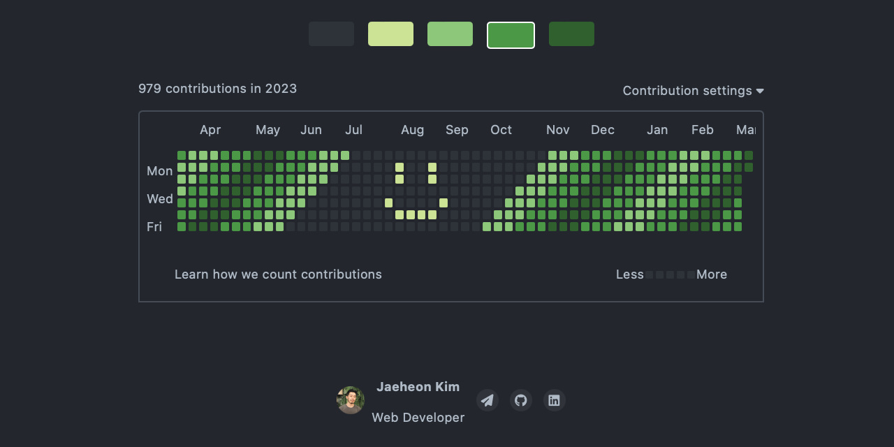
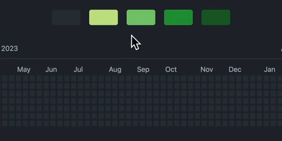

# GitHub Contribution Graph Art Maker


Simply create fake GitHub contribution graph art by drawing. This app is built with Sass and Typescript.

## Table of contents

- [Overview](#overview)
  - [Users Are able to...](#the-challenge)
  - [Screenshot](#screenshot)
  - [Links](#links)
- [My process](#my-process)
  - [Built with](#built-with)
  - [What I learned](#what-i-learned)
- [Future Developments](#future-developments)

## Overview

### Users Are able to...

- Change pen color and draw by holding mouse down or click
- See changes in the number of contributions corresponding to pixel art
- See the graph depending on the current local time

### Screenshot



### Links

- Live Site URL: [Netlify link](https://github-graph-art-maker.netlify.app)

## My process

### Built with

- Sass
- Typescript

### What I learned

```typescript
// index.ts
function setGraph() {
  const graph = document.getElementById("graph");
  let date = new Date();
  let dayOfWeek = date.getDay();
  let startDate = new Date();

  startDate.setDate(startDate.getDate() - (365 + dayOfWeek) + 1);
  for (let i = 0; i < 7; i++) {
    let row = document.createElement("tr");
    row.className = "row";
    for (let j = 0; j < 53; j++) {
      if (i > dayOfWeek && j == 52) break;

      let pixel = document.createElement("td");
      let commitDate = new Date(startDate);
      commitDate.setDate(startDate.getDate() + (j * 7 + i));
      pixel.className = "pixel";
      pixel.dataset.col = `${j}`;
      pixel.dataset.date =
        commitDate.getFullYear() +
        "-" +
        ("0" + (commitDate.getMonth() + 1)).slice(-2) +
        "-" +
        ("0" + commitDate.getDate()).slice(-2);

      row.appendChild(pixel);

      setMonths(pixel);
    }
    graph?.appendChild(row);
  }
}
```

`startDate.setDate(startDate.getDate() - (365 + dayOfWeek) + 1);`subtracts the number of days in a year plus the current day of the week plus one from the starting date. This ensures that the starting date falls on the first day of the first week of the previous year.

## Future Developments

- develop a feature users can take a screenshot
  - Using `html2canvas` for client-side screenshots
  - Generate screenshots with `getDisplayMedia`
  - [how-to-take-screenshots-in-the-browser-using-javascript](https://hackernoon.com/how-to-take-screenshots-in-the-browser-using-javascript-l92k3xq7)
